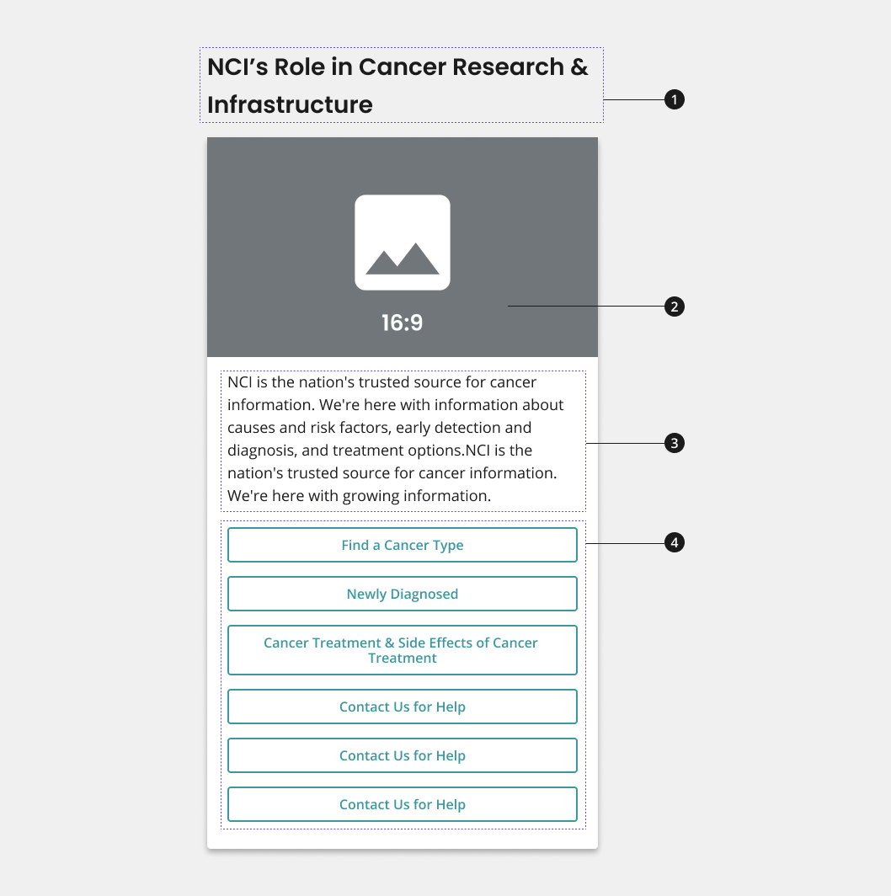

# Guide Card

A card component composed of an image (available for some variants), description (available for some variants), and between two and six call-to-action (CTAs) buttons.

[view in Figma]

## Overview



1.  Heading
2.  Image
3.  Description
4.  CTA button
5.  CTA button labels

## Variants

1.  Guide card with image and description
2.  Guide card without image and description

## Usage

Guide card with image and description

- Use heading to introduce the two-six CTAs featured on your guide card.
- [Not available for all variants] Use image and description to provide context for your group of CTAs and to explain how they relate to the larger message shared on your page.
- Use CTA buttons to provide users with links to two-six related CTAs. CTAs can lead to internal or external pages.
- Use descriptive, concise button labels within CTA buttons to indicate to user what page they will navigate to upon clicking.

#### Where to use

Use component on home, landing, and inner pages.

### When to use

Use Guide Card with Image and Description within the body of your page to direct users to CTA links (at least two and up to six) that drive to important content items for that audience.

### When to consider something else

- Showcasing CTAs for major initiatives or content marketing items that should be described further through an image and description.
  - Alternative: **Promo block**
- Showcasing one primary CTA or four CTAs that should be more prominently displayed than all other information on the page.
  - Alternative: **Hero with CTA Button**
- Showcasing one primary CTA or four CTAs that should be more prominently displayed than all other information on the page.
  - Alternative: **Hero with CTA button**
  - Alternative: **Hero with CTA button + CTA strip or aHero with tagline only + CTA strip**
- Sharing three sets of CTA.
  - Alternative: **Promo block**
- Sharing more than six CTAs.

## Best Practices

### Character Limits

Character limits are strongly recommended to ensure text is concise, scannable, and not visually distorted.

Character limits are based on best practices and when a line of text will be forced to wrap onto a second line of text on desktop.

- Card title: 32 characters
- Card description: 150 characters
- Button label text: 20 characters

### Image guidance and specs

**NCIDS Guide Card with Image and Description 16:9 Image Style**

- Name - NCIDS Guide Card with Image and Description 16:9
- Scale Width - 1304px
- Usage - The 16:9 Image Style will be used at all breakpoints

## Patterns

**2 Guide Card Row:**

- If using the guide card with image and description home page and/or landing page, consider using guide cards in rows of two to maintain the visual consistency of the site. Explore the NCIDS 2 guide card row pattern for more information. Learn more about this pattern on the [Home and landing page template page](INSERT LINK).

**3 Guide Card Row:**

- If using the guide card without image and description on a home page and/or landing page, consider using cards in rows of three to maintain the visual consistency of the site. Learn more about this pattern on the [Home and landing page template page](INSERT LINK).

## Accessibility

- **Aria-Labels provide an accessible name for an element.** If there is no visible name for the element, use aria-label to provide the user with a recognizable accessible name.

- The aria-label of this component is related to the anchor element of the card (the aria-label is on the anchor tag)

## Component Preview

```html
<section class="usa-section usa-section--light">
	<div class="grid-container">
		<div class="nci-title-aligned-card-group">
			<h2 class="nci-guide-card__header">
				Patients and Caregivers, with a Title Long Enough to Wrap to a Second
				Line
			</h2>
			<div class="nci-guide-card nci-guide-card--with-image-and-description">
				<div class="nci-guide-card__wrapper">
					<picture class="nci-guide-card__image">
						
					</picture>
					<div class="nci-guide-card__body">
						<p class="nci-guide-card__description">
							NCI is the nation's trusted source for cancer information. We're
							here with information about causes and risk factors, early
							detection and diagnosis, and treatment options.
						</p>
						<ul class="nci-card__button-group">
							<li>
								<a
									href="#"
									class="usa-button usa-button--outline usa-button--secondary"
									>Funding Opportunities</a
								>
							</li>
							<li>
								<a
									href="#"
									class="usa-button usa-button--outline usa-button--secondary"
									>Cancer Moonshot Funding Opportunities</a
								>
							</li>
							<li>
								<a
									href="#"
									class="usa-button usa-button--outline usa-button--secondary"
									>Funding Strategy</a
								>
							</li>
							<li>
								<a
									href="#"
									class="usa-button usa-button--outline usa-button--secondary"
									>Research Program Contacts</a
								>
							</li>
						</ul>
					</div>
				</div>
			</div>
			<h2 class="nci-guide-card__header">Researchers</h2>
			<div class="nci-guide-card nci-guide-card--with-image-and-description">
				<div class="nci-guide-card__wrapper">
					<picture class="nci-guide-card__image">
						
					</picture>
					<div class="nci-guide-card__body">
						<p class="nci-guide-card__description">
							Support for the best science underpins everything NCI does. NCI
							supports the best scientists and research projects through a
							rigorous grant application and peer review process.
						</p>
						<ul class="nci-card__button-group">
							<li>
								<a
									href="#"
									class="usa-button usa-button--outline usa-button--secondary"
									>Apply for a Grand</a
								>
							</li>
							<li>
								<a
									href="#"
									class="usa-button usa-button--outline usa-button--secondary"
									>Manage Your Award</a
								>
							</li>
							<li>
								<a
									href="#"
									class="usa-button usa-button--outline usa-button--secondary"
									>Grant Policies</a
								>
							</li>
							<li>
								<a
									href="#"
									class="usa-button usa-button--outline usa-button--secondary"
									>Grants and Management Contacts</a
								>
							</li>
						</ul>
					</div>
				</div>
			</div>
		</div>
	</div>
</section>
```

## Package

Import this Sass partial into your stylesheet

```scss nopreview
@forward "nci-guide-card";
```
