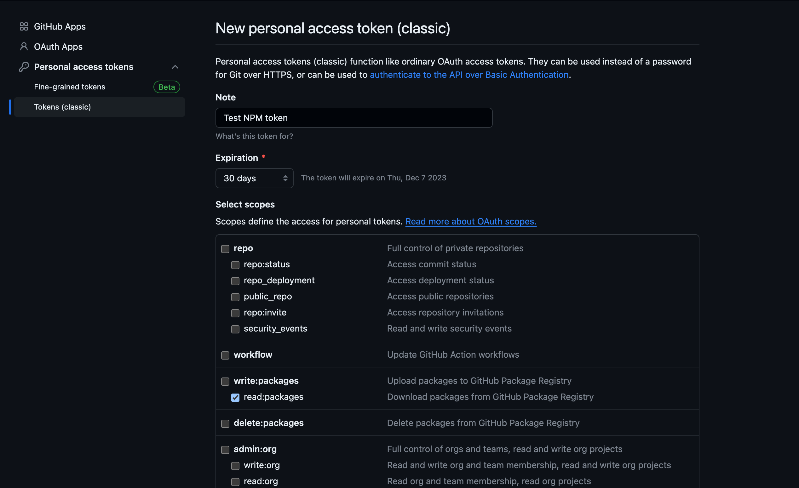

# Getting Started for Developers

To get started using the NCI design system (NCIDS) developers will go through three phases: installing, compiling, and customizing the code. This page provides a step-by-step guide, taking developers through the process of each of these phases. Please reference our [contact information](/about#contact-us) if additional support is needed.

- [Step 1: Install](#step-1-install-node-and-npm)
- [Step 2: Compile and Import](#step-2-compile-and-import)
- [Step 3: Customize](#step-3-customize)

## Step 1: Install Node and npm

The NCI Design System distributes our source code through a node package manager (npm), that uses a flavor of JavaScript called Node.js. The best way to add the Design System to your project is with npm via a Terminal window (check out some tips for using Terminal on a [Mac](https://support.apple.com/guide/terminal/open-or-quit-terminal-apd5265185d-f365-44cb-8b09-71a064a42125/mac) or [Windows](https://www.microsoft.com/en-us/p/windows-terminal/9n0dx20hk701?rtc=1&activetab=pivot:overviewtab)).

Installing the Design System with Node and npm not only allows you to install all the code the Design System needs to compile with just a couple commands, but will version any installed packages, like NCIDS, as well — meaning your project code is tied to a specific version of the Design System. Confirming what version you’re using and updating to a newer (or older) version is straightforward.

To download fonts, refer to the [Typography](/foundations/typography) page.

### Step 1.1: Install Node

1. Ensure that you have Node.js installed, preferably Node 18, to meet the required runtime environment.

2. Open your Terminal application and a Terminal window. Check to see if you have Node installed with `node -v`.

If you don’t have Node, we recommend installing it through a node version manager such as [Node Version Manager](https://github.com/nvm-sh/nvm) on a Mac or Linux machine, or [nvm-windows](https://github.com/coreybutler/nvm-windows) on a Windows machine. It can also be installed directly from [Node.js](https://nodejs.org/en/download/).

### Step 1.2: Authenticating to the NCIDS npm registry

NCIDS utilizes GitHub’s npm registry to host its packages. To access and download these packages, you need to be authenticated with a valid access token.

1. Create your personal access token. Follow the steps outlined in GitHub’s documentation for [creating a personal access token (classic)](https://docs.github.com/en/authentication/keeping-your-account-and-data-secure/managing-your-personal-access-tokens#creating-a-personal-access-token-classic). Ensure that, at a minimum, the required scopes are set to `read:packages`:
   

2. Log in to the @NCIOCPL Organizational Scope on npm. If you are using npm 9+, run the following command to log in to npm with the organizational scope and using the GitHub npm registry:

   ```bash
   npm login --scope=@NCIOCPL --auth-type=legacy --registry=https://npm.pkg.github.com
   ```

3. You will be prompted to enter your username and password. Please be sure to use your new classic personal access token as your password:

   ```
   > Username: <USERNAME>
   > Password: <TOKEN>
   ```

   If you are using npm less than 9, login without the legacy option:

   ```bash
   npm login --scope=@NCIOCPL --registry=https://npm.pkg.github.com
   ```

4. And follow the prompts to enter your email and password. Enter your token as your password.

   ```
   > Email: <USERNAME>@users.noreply.github.com
   > Password: <TOKEN>
   ```

For more details, see [authenticating with a personal access token](https://docs.github.com/en/packages/working-with-a-github-packages-registry/working-with-the-npm-registry#authenticating-with-a-personal-access-token).

### Step 1.3: Initialize your project in Node

1. Once you have Node and npm installed, go to the root of your project directory in Terminal. The root is the topmost directory associated with your project, the directory that includes all your project files and directories. In Terminal, the root will read as follows:

```bash
cd path/to/project/root
```

2. Initialize your project to create a file called package.json. Once you have this file, you can use npm to install software (or packages) like NCIDS.

```bash
npm init
```

This initialization will start a series of prompts at the command line. Usually the defaults (which are noted in parentheses) are okay for a simple project. You can always edit these values later.

In order to download the NCIDS, you will have to set up the @nciocpl organizational scope in npm to see the package. Create a `.npmrc` file in the root of your project containing the following:

```bash
@nciocpl:registry=https://npm.pkg.github.com
```

### Step 1.4: Install NCIDS

1. Now, you can install NCIDS into your project from the command line with npm. At minimum, your project will require the `ncids-css` package. Install it via the command line:

```bash
npm install @nciocpl/ncids-css
```

2. In order to use the javascript components, download the `ncids-js` package separately. Install it via the command line:

```bash
npm install @nciocpl/ncids-js
```

`Don’t modify the source code. Now that you’ve installed the NCIDS source code, it is controlled by npm and could be rewritten at any time.`

## Step 2: Compile and Import

### Step 2.1: Use a Sass Compiler

When using NCIDS, you must use [Dart Sass](https://www.npmjs.com/package/sass)— a modern Sass compiler that can parse Sass Module syntax. This process will convert the work you’ve done on your stylesheet in Sass into CSS.

To compile your code properly developers must do the following:

- **Autoprefixing**: NCIDS requires Autoprefixing your Cascading Style Sheets (CSS) with a specific .browserslistrc.
- **Sass Load Paths**: NCIDS requires Sass compilers use Load Paths that reference the /packages directory in the U.S. Web Design System (USWDS) package.

#### Apply Autoprefixer

The design system requires autoprefixing to work properly. Don't add vendor prefixes to your custom styles manually — it is more reliable to use autoprefixing.

We use the following autoprefixer settings via .browserslistrc config:

```js
> 2%
last 2 versions
not IE 11
not dead
```

#### How to use Sass Load Paths

`ncids-css` requires [Sass Load Paths](https://sass-lang.com/documentation/at-rules/use#load-paths) to compile for use in your project.

Load paths must include a path to the `/packages` directory for NCIDS packages and `/uswds-packages` for USWDS packages. An example using Webpack might look like:

```js
{
		loader: 'sass-loader',
		options: {
			sassOptions: {
				includePaths: [
					path.join(
						__dirname,
						'./node_modules/@nciocpl/ncids-css/packages'
					),
					path.join(
						__dirname,
						'./node_modules/@nciocpl/ncids-css/uswds-packages'
					),
				],
			},
		},
},
```

### Step 2.2: Import the Compiled Package

This next step consists of creating the sass stylesheet. For more detailed instructions on how to setup your project, visit our [example app repository](https://github.com/NCIOCPL/ncids-example-sites).

1. Create a sass stylesheet in your project and import the required sass partials:

```scss
@use 'uswds-core' with (
	$theme-image-path: '@nciocpl/ncids-css/uswds-img',
);
@forward 'uswds-global';
```

2. Add the packages from the NCIDS library that you need or add the entire NCIDS package library:

- Import only the packages you need. (recommended)

  ```scss
  @forward 'nci-header';
  @forward 'usa-breadcrumbs';
  @forward 'usa-footer';
  ```

- Import the entire ncids-css library. _This is not recommended due to the file size that will be generated._

  ```scss
  @forward 'ncids';
  ```

3. Create an index.js file. This is the entrypoint file set in the compiler of your project:

```js
import './styles.scss';

console.log('hello world');
```

#### How to import and manage your Sassy Cascading Style Sheets (SCSS)

The @use and @forward directives are used to import and manage Sassy Cascading Style Sheets (SCSS) modules and partials.

- `@use` directive allows you to import and use functionality from other SCSS modules. It provides better encapsulation and avoids conflicting global CSS class names. Use it to import SCSS modules that contain reusable styles, mixins, variables, or functions.

- `@forward` directive allows you to re-export styles from one module to another. It acts as a bridge between different SCSS modules, making styles available for import in other files. Use it when you want to expose certain styles or functionality from one module to be used in another.

**Note:** The load paths option for importing Sass partials or modules is specific to **Dart Sass**. If you're using another Sass implementation, such as Node Sass, LibSass, or Ruby Sass, the load paths option may not be available. Make sure to use the appropriate load path mechanism specific to your chosen Sass implementation.

## Step 3: Customize

Customize the design system with settings and custom code.

Reference [USWDS Settings](https://designsystem.digital.gov/documentation/settings/) documentation for information on each of the settings available in the settings files, as well as the values the settings accept. Most settings accept design tokens, reference our [Foundations](/foundations) information of our website for more information on the available tokens for color, spacing units, font size, and more.
