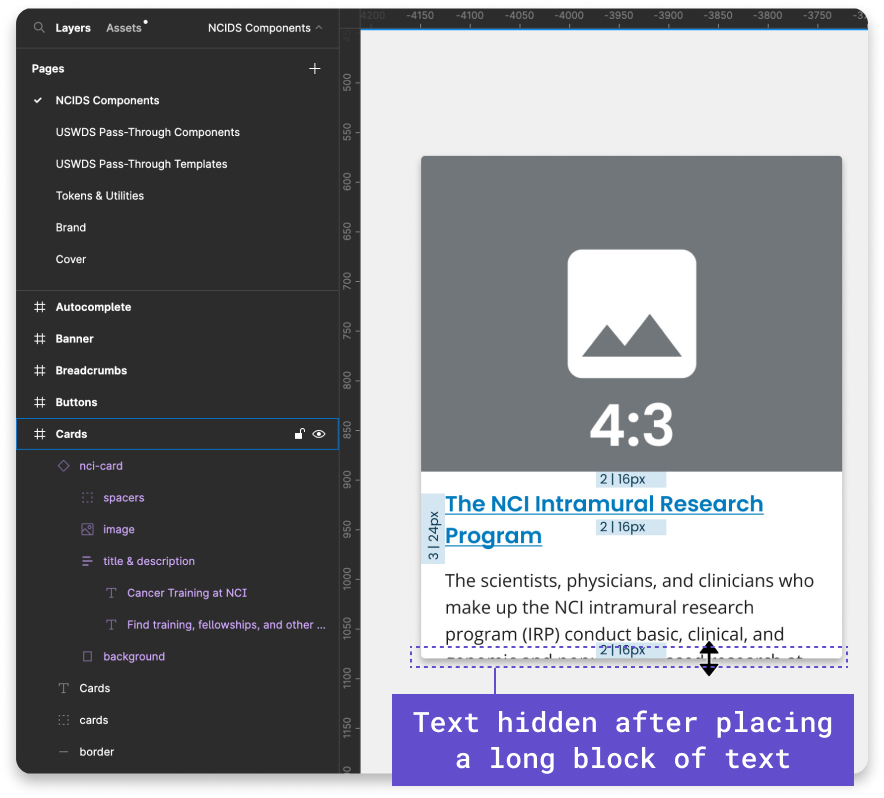

# NCIDS Figma Guide

Jump-start your designs with ready-made elements in the NCI Design System (NCIDS) Design Kit.

[Access NCIDS Design Kit](https://www.figma.com/community/file/1288512334920909770/ncids-design-kit).

Figma is our tool of choice when creating compositions and mock-ups using our design system. Download an instance of the file from the Figma community to use in your designs. You will need a Figma account to download the file.

_Please note: This page includes a guide of how we have set up the NCIDS Design Kit in Figma. This is not a comprehensive guide on how to use Figma. Please refer to the [Figma website’s help articles](https://help.figma.com/hc/en-us) for any specific questions related to the application._

## Fonts

Download fonts from Google Fonts.

- [Poppins](https://fonts.google.com/specimen/Poppins)
- [Open Sans](https://fonts.google.com/specimen/Open+Sans)

Download the full font family of each font and enable it on your computer to use in Figma.

### Poppins

Used for component paragraph styles and headings.

### Open Sans

Used for body text, descriptive text, buttons, and in other various component labels.

## How to Use the NCIDS Design Kit as a Library in Figma

### Enabling the Library on Your Account

Select the “Open in Figma” button on the community page for NCIDS and add this to your personal or team account. The file will be added to your drafts. Once the file is open, select the down arrow next to the file name at the top of the page and select “Publish Library.” Then move it to the team you want to enable the library for. This will allow you to use the library in all your design files. In the “Publish Library” window, make sure all styles and components are enabled. Select the “Publish” button, and you’re now ready to use the NCIDS Design Kit in your design comps and mock-ups.

### The Figma File Includes NCIDS Components, USWDS Pass-Through Components, and Tokens and Utilities

The components, tokens, and utilities are organized on pages. The “Cover” page is simply used for a thumbnail. This thumbnail appears when the file is shared as a link.

NCIDS components: Components that either have been modified from a U.S. Web Design System (USWDS) components or new components that have been created for NCI specifically.

USWDS pass-through components: Components directly from USWDS that have not been modified, except for fonts and colors.

Tokens and utilities: Configurable tokens and utilities that can be set in Figma, as well as ones that cannot be set but their styles can be referenced. Tokens and utilities that cannot be set in Figma are noted on those respective artboards.

### Components

All components closely align with their corresponding developed variants. We include all components that are live and available to use in the NCIDS. As new components are added, updates to the NCIDS Design Kit will be available on the Figma community.

Each component is built out for each breakpoint. By default, spacers are turned on in each component’s variant, which shows the spacing units that will match the component in the code. You can simply turn off the spacers by hiding those layers.

When you want to use a component in your compositions or mock-ups, access the library from the “Resources” icon in your Figma file. Select the component you want to use, and place it in your comp. You can change the breakpoint and variation of the component on the right bar.

To adjust the text in a component, select the text layer and edit it. To adjust the image, select the image layer, and select a new image in the “Fill” layer on the right side. Image crop sizes are defined with placeholder images.

If you need to resize the component after placing longer or shorter text blocks, simply drag the bounding box of the component to where the bottom of the text block meets the spacer. Ensure that the top of the spacer meets the bottom of the text’s bounding box, not the bottom of the descender.

## Using Our Tokens and Utilities

Maintenance by a dedicated team of designers, developers, information architects, and product managers.

### Text Styles and NCI Heading Styles

You can apply text styles and NCI heading styles to your design compositions or prototypes. We do not recommend editing the text styles that are already configured in components. You can reference text styles and heading styles on the [Tokens and Utilities page](https://www.figma.com/design/4FeMfprVErO6esR8FLczp5/NCIDS-Design-Kit?node-id=3917-6868&p=f). Text and NCI heading styles can be applied under the “Text” heading on the right-hand side bar of Figma.

### Color Styles

We have included our state, theme, and system tokens on the Tokens and Utilities page. Theme and state tokens show in their description what system token they pull from. Color tokens can be applied to components under “Selection Colors” and to shapes under “Fill” by selecting the icon with 4 dots on the right-hand side bar.

### Effect Styles

NCIDS uses the Cascading Style Sheet property “box-shadow’” to set an item’s drop shadow. In Figma, “Box Shadow” is equivalent to “Drop Shadow” and can be applied under the “Effects” setting from the right-hand side bar.

### Grid Styles

The grid is mobile-first, powered by flexbox, and based on a 12-column system. Grids are only visible in editing view in Figma; they are not visible in preview mode. Add a grid to your artboard by selecting the artboard. On the right-hand side, you will see “Layout Grid” where you can select the grid style that fits the breakpoint you are designing for.

### Applying Other Utilities That Are Not Added to the NCIDS Design Kit Library

On the [Tokens and Utilities](https://www.figma.com/design/4FeMfprVErO6esR8FLczp5/NCIDS-Design-Kit?node-id=3917-6868&t=YVntX6mh1NZavZkA-1), find other utilities you can apply that are not added to the NCIDS Design Kit library on the right-hand side bar when you are designing a composition or prototype. Border, border radius, and outline are all utilities that can be referenced on this page on how to apply these styles to your designs.

### Spacing Units

Spacing unit tokens are based on multiples of 8 and are used in all components and between components. Spacing units are applied to components in the NCIDS Design Kit and are visible by default. When placing the components in your designs, spacers can be turned off by “hiding” the spacers layer on the left-hand bar. Find examples of how to place spacing tokens between components in our [Design Kit](https://www.figma.com/design/4FeMfprVErO6esR8FLczp5/NCIDS-Design-Kit?node-id=0-1&p=f).

### Using Our Templates

We have provided template files, which let you see how components will stack on a page at each breakpoint, which also include component patterns such as 3-card row and guide card rows. Use these templates to kick-start your design compositions or prototypes.

### Brand Usage Guidelines

We have provided logos for various divisions, offices, and centers on the [Brand page](https://www.figma.com/design/4FeMfprVErO6esR8FLczp5/NCIDS-Design-Kit?node-id=4384-6350&p=f).

### Reviewing Updates

When updates to the library are available, you will receive a notification in Figma that there are updates to the NCIDS Design Kit library. Review the updates before accepting them as they may break your layout or design and you will not be able to undo those changes. We recommend saving your version history of files in case you need to revert changes.
