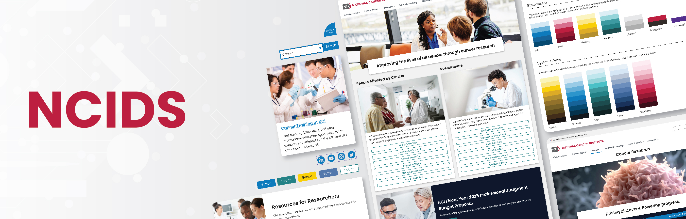

# The NCI Design System

NCIDS is an adaptation of the U.S. Web Design System (USWDS) created for NCI informational websites and applications to enhance their user experience, increase accessibility, and offer opportunities for efficiencies and consistency.

With NCIDS, teams can:

- Quickly develop and launch websites and web applications in line with NCI, NIH, HHS, and federal policies and guidelines
- Modernize their websites through adherence to modern web/digital standards and best practices
- Leverage user research that optimizes the design and user experience
- Align with the regular practices of modern digital shops and large organizations

NCIDS is an important component of NCI’s Digital Strategy, embodying its key principles to make the digital strategy a reality for teams working to create a unified, audience-focused, and data-informed presence for NCI. [Learn more about the NCIDS.](/about)

## [Start Designing](/get-started/designers)

Explore our guidelines, get access to the NCIDS Figma files, and join our Figma Community.

## [Start Developing](/get-started/developers)

Set up your environment using the NCIDS components, utilities, and design tokens.

## [Explore our Design Philosophy](/design-principles/)

Learn more about our commitment to creating a consistent and seamless user experience for NCI.

## [Get Support](/about#contact-us)

Engage with the Office of Disseminations & Digital Communications (ODDC) Pilot team if you have any questions, thoughts, or suggestions to help us improve the NCIDS.
