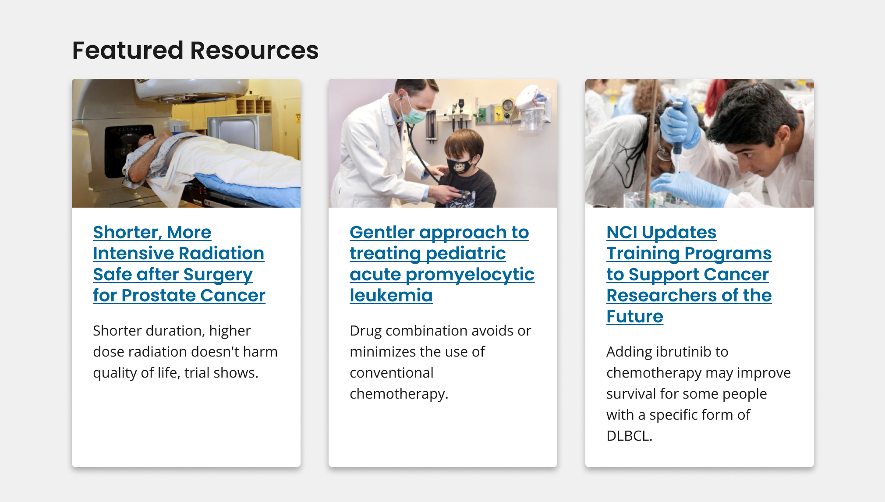

# 3-Card Row

A 3-card row is a pattern of three cards united by a common theme, subject, or content type.

[View in Figma](https://www.figma.com/file/4FeMfprVErO6esR8FLczp5/NCIDS-Design-Kit?type=design&node-id=5280%3A38952&mode=design&t=lGwrxbWFW3JAwAet-1)

## Overview



It is recommended that a 3-card row be composed of three ‘Cards’. Refer to [Card](/components/card) for specific attributes of the card component.

## Usage

- Use heading to introduce content within the cards and to provide context for the association between cards in the 3-card row.

### Where to use

- Use this component patten on home and landing pages.
  - Using one or two card components on a home or landing page is not recommended to maintain the visual consistency of the site.

### When to use

- Use three cards in a row on your home or landing pages to showcase multiple content items such as articles, blogs, news, or events— while also highlighting the association between these content items.
- Refer to the card component page for alternative component guidance.

## Best Practices

Refer to [Card](/components/card) for best practice recommendations specific to the card.

### Character limits

Character limits are strongly recommended to ensure text is concise, scannable, and not visually distorted.

_Character limits are based on best practices and when a line of text will be forced to wrap onto a second line of text on desktop._

- 3-card row heading: 40 characters

## Accessibility

- **Use unordered lists and list items.** Use a `<ul>` for a card group and an `<li>` for each card. This formatting allows screen readers to enumerate the items in the card group and allows shortcuts between list items.
- **Use the appropriate heading level for your page.** Update heading level based on the content of your page to make sure card headings are in the correct, logical outline order.
- **Use CSS to order the media element.** Logically, the media element should follow the header element. Don’t re-organize the markup to reverse their order.

```html
<div class="grid-container margin-y-3">
	<ul class="nci-card-group">
		<li class="nci-card desktop:grid-col-4">
			<a href="https://www.cancer.gov" aria-label="Card">
				<picture class="nci-card__image">
					<source
						media="(min-width: 1024px)"
						srcset="../feature-card-images/news1-4x3.jpg"
					/>
					
				</picture>
				<div class="nci-card__body">
					<span class="nci-card__title">CRCHD Diversity Training</span>
					<p class="nci-card__description">
						Treatment for severe COVID-19 with interferons decreased the viral
						load of SARS-CoV-2, a new study found.
					</p>
				</div>
			</a>
		</li>
		<li class="nci-card desktop:grid-col-4">
			<a href="https://www.cancer.gov" aria-label="Card">
				<picture class="nci-card__image">
					<source
						media="(min-width: 1024px)"
						srcset="../feature-card-images/news2-4x3.jpg"
					/>
					
				</picture>
				<div class="nci-card__body">
					<span class="nci-card__title">
						Grant Application Development, Submission, Review, & Award
					</span>
					<p class="nci-card__description">
						In patients with certain variations in the OAS1 gene, treatment for
						severe COVID-19 with interferons decreased the viral load of
						SARS-CoV-2, a new study found.
					</p>
				</div>
			</a>
		</li>
		<li class="nci-card desktop:grid-col-4">
			<a href="https://www.cancer.gov" aria-label="Card">
				<picture class="nci-card__image">
					<source
						media="(min-width: 1024px)"
						srcset="../feature-card-images/news3-4x3.jpg"
					/>
					
				</picture>
				<div class="nci-card__body">
					<span class="nci-card__title">Capacitación en diversidad CRCHD</span>
					<p class="nci-card__description">
						El tratamiento para la COVID-19 grave con interferones disminuyó la
						carga viral del SARS-CoV-2, según encontró un nuevo estudio.
					</p>
				</div>
			</a>
		</li>
	</ul>
</div>
```

## Package

Import this Sass partial into your stylesheet

```scss
# Single Card Component
@forward "nci-card";

# Card Group Component
@forward "nci-card-group";
```
