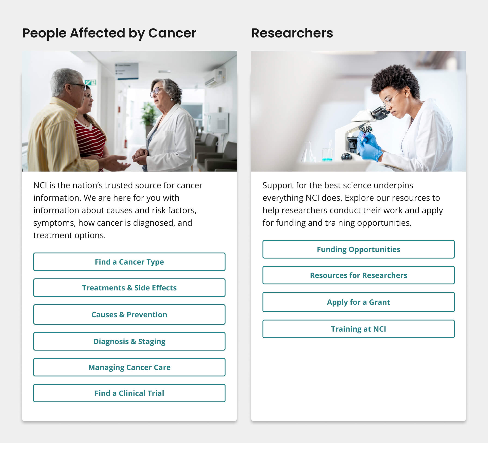
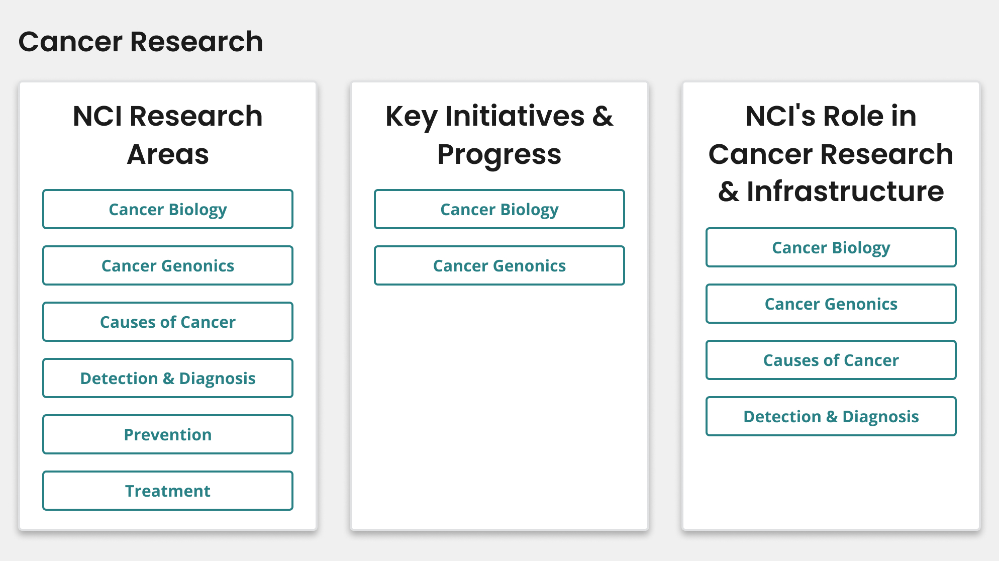

# Guide Card Row

The Guide Card component can be assembled into a pattern of two or three guide cards, each guide card providing a set of 2-6 links to related resources.

[View in Figma](https://www.figma.com/file/4FeMfprVErO6esR8FLczp5/NCIDS-Design-Kit?type=design&node-id=5321%3A7481&mode=design&t=lGwrxbWFW3JAwAet-1)

## Overview

The 2 guide card row pattern is composed of 2 guide cards with image and description.



The 3 guide card row pattern is composed of 3 guide cards without image or description.



Refer to [Guide Card](/components/guide-card) for specific attributes of the guide card component.

## Usage

### Where to use

- Use these component patterns on home and landing pages.
  - Using 1 guide card component (with or without image and description) on a home or landing page is **not recommended** to maintain the visual consistency of the site.

### When to use

- Use the 2 guide card row pattern within your home or landing pages to showcase two sets of 2-6 links to related resources.
  - We recommend grouping related links together within a guide card. However, the guide cards within this pattern do not have to be associated thematically.
- Use the 3 guide card row pattern within your home or landing pages to showcase three sets of 2-6 links to related resources.
  - We recommend grouping related links together within a guide card. However, all three guide cards do not have to be associated thematically to be a part of this pattern.

### When to consider something else

- Showcasing call-to-actions (CTAs) for major initiatives or content marketing items that should be described further through an image and description.
  - Alternative: [Promo block](/components/promo-block), promoting content for major initiatives will stand out better as a single item with an image and description using a promo block.
- Showcasing multiple content items such as articles, blogs, news, or events— while also highlighting the association between these content items.
  - Alternative: [3-Card Row](/templates/3-card-row)
- Showcasing one primary CTA that should be more prominently displayed than all other information on the page.
  - Alternative: [Hero with CTA Button](/components/hero)

## Best Practices

Refer to [Guide Card](/components/guide-card) for best practice recommendations specific to the guide card.

## Component Preview

### Guide card with image and description

```html
<div class="nci-title-aligned-card-group">
	<h2 class="nci-guide-card__header">
		Patients and Caregivers, with a Title Long Enough to Wrap to a Second Line
	</h2>
	<div class="nci-guide-card nci-guide-card--with-image-and-description">
		<div class="nci-guide-card__wrapper">
			<picture class="nci-guide-card__image">
				
			</picture>
			<div class="nci-guide-card__body">
				<p class="nci-guide-card__description">
					NCI is the nation's trusted source for cancer information. We're here
					with information about causes and risk factors, early detection and
					diagnosis, and treatment options.
				</p>
				<ul class="nci-card__button-group">
					<li>
						<a
							href="#!"
							class="usa-button usa-button--outline usa-button--secondary"
							>Funding Opportunities</a
						>
					</li>
					<li>
						<a
							href="#!"
							class="usa-button usa-button--outline usa-button--secondary"
							>Cancer Moonshot Funding Opportunities</a
						>
					</li>
					<li>
						<a
							href="#!"
							class="usa-button usa-button--outline usa-button--secondary"
							>Funding Strategy</a
						>
					</li>
					<li>
						<a
							href="#!"
							class="usa-button usa-button--outline usa-button--secondary"
							>Research Program Contacts</a
						>
					</li>
					<li>
						<a
							href="#!"
							class="usa-button usa-button--outline usa-button--secondary"
							>Key NCI Initiatives</a
						>
					</li>
					<li>
						<a
							href="#!"
							class="usa-button usa-button--outline usa-button--secondary"
							>Find a Clinical Trial</a
						>
					</li>
				</ul>
			</div>
		</div>
	</div>
	<h2 class="nci-guide-card__header">Researchers</h2>
	<div class="nci-guide-card nci-guide-card--with-image-and-description">
		<div class="nci-guide-card__wrapper">
			<picture class="nci-guide-card__image">
				
			</picture>
			<div class="nci-guide-card__body">
				<p class="nci-guide-card__description">
					Support for the best science underpins everything NCI does. NCI
					supports the best scientists and research projects through a rigorous
					grant application and peer review process.
				</p>
				<ul class="nci-card__button-group">
					<li>
						<a
							href="#!"
							class="usa-button usa-button--outline usa-button--secondary"
							>Apply for a Grant</a
						>
					</li>
					<li>
						<a
							href="#!"
							class="usa-button usa-button--outline usa-button--secondary"
							>Manage Your Award</a
						>
					</li>
					<li>
						<a
							href="#!"
							class="usa-button usa-button--outline usa-button--secondary"
							>Grant Policies</a
						>
					</li>
					<li>
						<a
							href="#!"
							class="usa-button usa-button--outline usa-button--secondary"
							>Grants and Management Contacts</a
						>
					</li>
				</ul>
			</div>
		</div>
	</div>
</div>
```

### Guide card without image and description

```html
<div class="grid-container">
	<h2 class="nci-guide-card__header">
		Your Guide to NCI Grants &amp; Training
	</h2>

	<ul class="nci-card-group">
		<li class="nci-guide-card desktop:grid-col-4">
			<div class="nci-guide-card__wrapper">
				<div class="nci-guide-card__body">
					<h2 class="nci-guide-card__title">Research Grant Funding</h2>
					<ul class="nci-card__button-group">
						<li>
							<a
								href="#!"
								class="usa-button usa-button--outline usa-button--secondary"
								>Funding Opportunities</a
							>
						</li>
						<li>
							<a
								href="#!"
								class="usa-button usa-button--outline usa-button--secondary"
								>Cancer Moonshot Funding Opportunities</a
							>
						</li>
						<li>
							<a
								href="#!"
								class="usa-button usa-button--outline usa-button--secondary"
								>Funding Strategy</a
							>
						</li>
						<li>
							<a
								href="#!"
								class="usa-button usa-button--outline usa-button--secondary"
								>Research Program Contacts</a
							>
						</li>
						<li>
							<a
								href="#!"
								class="usa-button usa-button--outline usa-button--secondary"
								>Grant Policies</a
							>
						</li>
						<li>
							<a
								href="#!"
								class="usa-button usa-button--outline usa-button--secondary"
								>Grants and Management Contacts</a
							>
						</li>
					</ul>
				</div>
			</div>
		</li>

		<li class="nci-guide-card desktop:grid-col-4">
			<div class="nci-guide-card__wrapper">
				<div class="nci-guide-card__body">
					<h2 class="nci-guide-card__title">Grants Process</h2>
					<ul class="nci-card__button-group">
						<li>
							<a
								href="#!"
								class="usa-button usa-button--outline usa-button--secondary"
								>Apply for a Grant</a
							>
						</li>
						<li>
							<a
								href="#!"
								class="usa-button usa-button--outline usa-button--secondary"
								>Manage Your Award</a
							>
						</li>
					</ul>
				</div>
			</div>
		</li>

		<li class="nci-guide-card desktop:grid-col-4">
			<div class="nci-guide-card__wrapper">
				<div class="nci-guide-card__body">
					<h2 class="nci-guide-card__title">Funding for Training</h2>
					<ul class="nci-card__button-group">
						<li>
							<a
								href="#!"
								class="usa-button usa-button--outline usa-button--secondary"
								>Funding for Cancer Training</a
							>
						</li>
						<li>
							<a
								href="#!"
								class="usa-button usa-button--outline usa-button--secondary"
								>Research Training at NCI</a
							>
						</li>
						<li>
							<a
								href="#!"
								class="usa-button usa-button--outline usa-button--secondary"
								>Building a Diverse Workforce</a
							>
						</li>
						<li>
							<a
								href="#!"
								class="usa-button usa-button--outline usa-button--secondary"
								>Training Program Contacts</a
							>
						</li>
					</ul>
				</div>
			</div>
		</li>
	</ul>
</div>
```

## Package

Import this Sass partial into your stylesheet

```scss
@forward "nci-guide-card";
```
