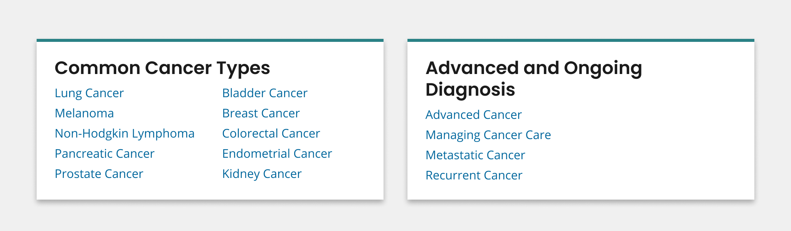

# Summary Box Row

A summary box row is a pattern of two summary box components each displaying two different types of key information or next steps.

[View in Figma](https://www.figma.com/file/4FeMfprVErO6esR8FLczp5/NCIDS-Design-Kit?type=design&node-id=5469%3A8156&mode=design&t=9xNemHVdk0y2K4UA-1)

## Overview



It is recommended that a summary box row be composed of two summary box components. Refer to the [Summary Box](/components/summary-box) for specific attributes of that component.

## Usage

### Where to use

- Use component on landing and inner pages.

### When to use

- Use if aiming to provide two different sets of key information, next steps or CTAs at the start of your page. Refer to the [Summary Box Component](/components/summary-box) for alternative guidance.

## Best Practices

Refer to the [Summary Box Component](/components/summary-box) for best practice recommendations specific to the summary box.

```html
<div class="grid-container">
	<div
		class="grid-row tablet-lg:grid-gap-4 grid-gap-2 flex-row flex-align-stretch"
	>
		<div class="tablet:grid-col-6 display-flex flex-align-stretch">
			<div
				class="usa-summary-box"
				role="region"
				aria-labelledby="summary-box-key-information"
			>
				<div class="usa-summary-box__body">
					<h3 class="usa-summary-box__heading" id="summary-box-key-information">
						Common Cancer Types
					</h3>
					<div class="usa-summary-box__text">
						<div class="grid-row grid-gap-3">
							<ul class="usa-list usa-list--unstyled tablet-lg:grid-col-6">
								<li>
									<a
										class="usa-summary-box__link text-no-underline hover:text-underline"
										href="#"
									>
										Lung Cancer
									</a>
								</li>
								<li>
									<a
										class="usa-summary-box__link text-no-underline hover:text-underline"
										href="#"
									>
										Melanoma
									</a>
								</li>
								<li>
									<a
										class="usa-summary-box__link text-no-underline hover:text-underline"
										href="#"
									>
										Non-Hodgkin Lymphoma
									</a>
								</li>
								<li>
									<a
										class="usa-summary-box__link text-no-underline hover:text-underline"
										href="#"
									>
										Pancreatic Cancer
									</a>
								</li>
								<li>
									<a
										class="usa-summary-box__link text-no-underline hover:text-underline"
										href="#"
									>
										Prostate Cancer
									</a>
								</li>
							</ul>
							<ul class="usa-list usa-list--unstyled tablet-lg:grid-col-6">
								<li>
									<a
										class="usa-summary-box__link text-no-underline hover:text-underline"
										href="#"
									>
										Bladder Cancer
									</a>
								</li>
								<li>
									<a
										class="usa-summary-box__link text-no-underline hover:text-underline"
										href="#"
									>
										Breast Cancer
									</a>
								</li>
								<li>
									<a
										class="usa-summary-box__link text-no-underline hover:text-underline"
										href="#"
									>
										Colorectal Cancer
									</a>
								</li>
								<li>
									<a
										class="usa-summary-box__link text-no-underline hover:text-underline"
										href="#"
									>
										Endometrial Cancer
									</a>
								</li>
								<li>
									<a
										class="usa-summary-box__link text-no-underline hover:text-underline"
										href="#"
									>
										Kidney Cancer
									</a>
								</li>
							</ul>
						</div>
					</div>
				</div>
			</div>
		</div>
		<div class="tablet:grid-col-6 display-flex flex-align-stretch">
			<div
				class="usa-summary-box"
				role="region"
				aria-labelledby="summary-box-key-information"
			>
				<div class="usa-summary-box__body">
					<h3 class="usa-summary-box__heading" id="summary-box-key-information">
						Advanced and Ongoing Diagnosis
					</h3>
					<div class="usa-summary-box__text">
						<ul class="usa-list usa-list--unstyled">
							<li>
								<a
									class="usa-summary-box__link text-no-underline hover:text-underline"
									href="#"
								>
									Advanced Cancer
								</a>
							</li>
							<li>
								<a
									class="usa-summary-box__link text-no-underline hover:text-underline"
									href="#"
								>
									Managing Cancer Care
								</a>
							</li>
							<li>
								<a
									class="usa-summary-box__link text-no-underline hover:text-underline"
									href="#"
								>
									Metastatic Cancer
								</a>
							</li>
							<li>
								<a
									class="usa-summary-box__link text-no-underline hover:text-underline"
									href="#"
								>
									Recurrent Cancer
								</a>
							</li>
						</ul>
					</div>
				</div>
			</div>
		</div>
	</div>
</div>
```

## Package

Import this Sass partial into your stylesheet

```scss nopreview
@forward "usa-summary-box";
@forward "usa-layout-grid";
@forward "usa-list";
@forward "uswds-utilities";
```
